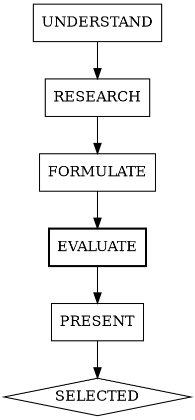

# Planning

## Overview

Research-first planning. Validate approaches against real documentation, real codebases, and real implementations before writing code. Dual-engine evaluation cross-validates feasibility.

**Core principle:** No implementation without evidence-backed, cross-validated approach selection.

**Announce at start:** "I'm using the planning skill to research approaches before implementation."

## When to Use

- New feature requiring architectural decisions
- Unfamiliar library or pattern
- Multiple valid approaches exist
- User asks "how should we build X?"

**Don't use for:** Single-line fixes, obvious bugs, tasks with explicit instructions.

## State Persistence

All planning artifacts are persisted to enable plan-to-review linkage:

```
plans/{slug}/
  state.json          # phase, timestamp, selected approach
  approaches.json     # the 3 approaches with evidence
  claude-eval.json    # Claude's evaluation
  codex-eval.json     # Codex's evaluation (or skip marker)
  synthesis.json      # synthesizer output
```

Generate slug from feature name: lowercase, hyphens for spaces, strip special chars, truncate to 50 chars.

**state.json:**
```json
{
  "feature": "description",
  "phase": "UNDERSTAND|RESEARCH|FORMULATE|EVALUATE|PRESENT|SELECTED",
  "timestamp": "ISO-8601",
  "selectedApproach": null
}
```

## The Process



### UNDERSTAND

Clarify scope with the user. Identify:
- What the feature needs to do
- Constraints (performance, compatibility, existing patterns)
- Technologies already in use

Create `plans/{slug}/` directory and initialize `state.json` with `phase: "UNDERSTAND"`.

### RESEARCH

**All three sources are REQUIRED. Do them in parallel using subagents.**

#### Context7: Current Library Docs
```
1. resolve-library-id for each relevant library
2. query-docs for the specific feature/API needed
3. Note: version-specific gotchas, recommended patterns, deprecations
```

#### Serper Search: Real-World Implementations
```
1. Search for "[feature] [framework] implementation"
2. Search for "[feature] best practices [year]"
3. Look for: blog posts with code, official guides, comparison articles
```

#### GitHub: Analogous Codebases
```
1. search-code for the pattern/API in real projects
2. search-repositories for projects solving the same problem
3. Look for: how production codebases structure this, common pitfalls
```

Update `state.json` with `phase: "RESEARCH"`.

### FORMULATE

Formulate exactly 3 approaches. For each approach, provide:

```
### Approach N: [Name]

**How it works:** [2-3 sentences]

**Evidence:**
- Context7: [what the docs say about this approach]
- Serper: [what real-world articles recommend]
- GitHub: [how production codebases do it]

**Trade-offs:**
- Pro: [concrete benefit with source]
- Pro: [concrete benefit with source]
- Con: [concrete drawback with source]

**Fits this project because:** [why this works for the specific codebase]
```

Write `plans/{slug}/approaches.json`:
```json
[
  {
    "index": 1,
    "name": "Approach Name",
    "howItWorks": "description",
    "evidence": { "context7": "...", "serper": "...", "github": "..." },
    "tradeoffs": { "pros": ["..."], "cons": ["..."] },
    "fitReason": "..."
  }
]
```

Update `state.json` with `phase: "FORMULATE"`.

### EVALUATE

Dual-engine evaluation of the formulated approaches. This phase runs Claude and Codex in parallel to cross-validate feasibility assessments.

**Step 1 — Claude evaluation:**

Spawn a Claude agent (Opus) to evaluate `approaches.json` against the project context. The agent reads:
- `plans/{slug}/approaches.json`
- Relevant project files (package.json, existing architecture, etc.)

Returns evaluation as JSON:
```json
{
  "engine": "claude",
  "evaluations": [
    {
      "approachIndex": 1,
      "feasibility": "high|medium|low",
      "risks": ["risk 1", "risk 2"],
      "strengths": ["strength 1"],
      "implementationNotes": "specific details"
    }
  ],
  "preferredApproach": 1,
  "reason": "why this approach is best"
}
```

Write to `plans/{slug}/claude-eval.json`.

**Step 2 — Codex evaluation (background):**

Write a prompt file containing `approaches.json` content + project context, then launch:

```bash
./scripts/run-engine.sh codex plans/{slug}/codex-eval-prompt.txt plans/{slug}/codex-eval.json --timeout 120 &
```

The prompt instructs Codex to return the same evaluation JSON format with `"engine": "codex"`.

**Step 3 — Synthesize:**

After both complete, spawn the `synthesizer` agent in **planning mode**. Provide:
- `plans/{slug}/claude-eval.json`
- `plans/{slug}/codex-eval.json`
- Instructions to operate in `planning` mode

The synthesizer will:
- Compare evaluations by approach index
- Classify agreement/disagreement on preferred approach
- Merge unique risks and strengths from each engine
- Return merged evaluation with recommendation confidence

Write synthesizer output to `plans/{slug}/synthesis.json`.

Update `state.json` with `phase: "EVALUATE"`.

### PRESENT

Present all 3 approaches to the user with:
1. The original evidence from RESEARCH
2. The cross-validated evaluation from EVALUATE (synthesis.json)
3. Highlight where engines agreed (strong signal) or disagreed (flag for human decision)

State your recommendation, incorporating synthesis confidence. Wait for user selection before writing any code.

### SELECTED

Record the user's choice:
- Update `state.json` with `phase: "SELECTED"` and `selectedApproach: N`
- Proceed with implementation

## Plan-to-Review Linkage

The `code-reviewer` agent can read `plans/{slug}/approaches.json` and `state.json` to validate that implementation matches the selected approach. When running code review after a planned feature, reference the plan directory.

## Red Flags

**Never:**
- Skip MCP research and guess at approaches
- Present approaches without evidence from real sources
- Start implementation before user selects an approach
- Present fewer than 3 or more than 3 approaches
- Use only one MCP source (all three required)
- Skip the EVALUATE phase even if Codex is unavailable (Claude-only eval still adds value)

**If MCP is unavailable:**
- Note which source is missing
- Use WebSearch as fallback for that source
- Still present 3 evidence-backed approaches

**If Codex is unavailable:**
- Claude-only evaluation proceeds normally
- Synthesizer passes through Claude eval with `crossValidated: false`
- Status message: "Codex not available — Claude-only evaluation."

## Quality Checklist

- [ ] All three MCP sources consulted (Context7, Serper, GitHub)
- [ ] Exactly 3 approaches with concrete trade-offs
- [ ] Each approach cites real evidence (not hypothetical)
- [ ] EVALUATE phase completed (synthesis.json exists)
- [ ] Cross-validation results shown to user
- [ ] Recommendation stated with reasoning
- [ ] User selected approach before implementation began
- [ ] `plans/{slug}/state.json` records selected approach
